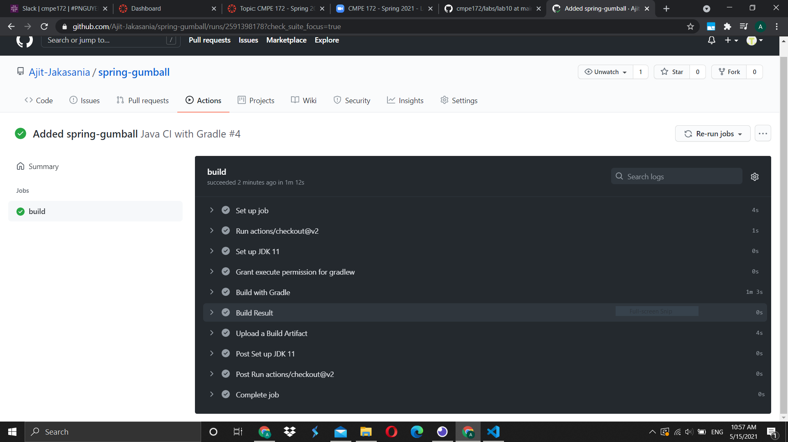
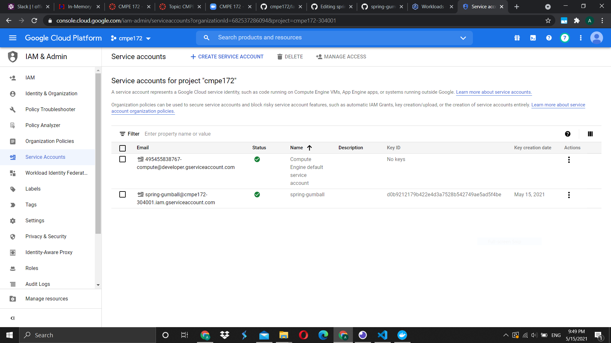
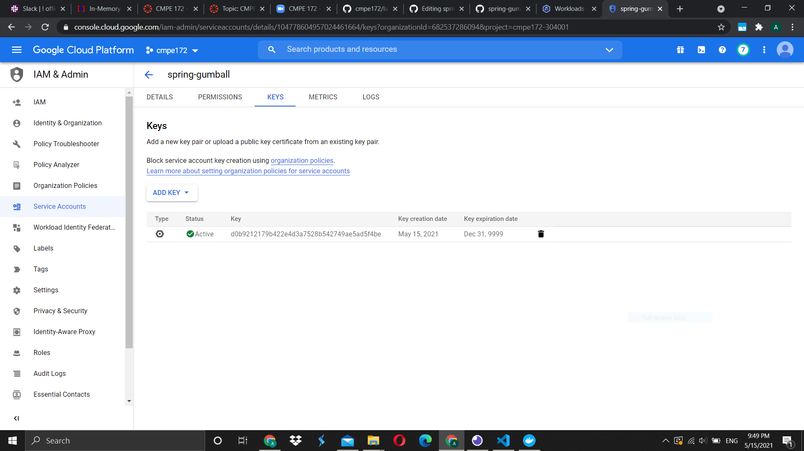
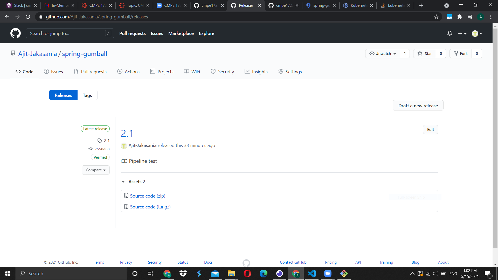
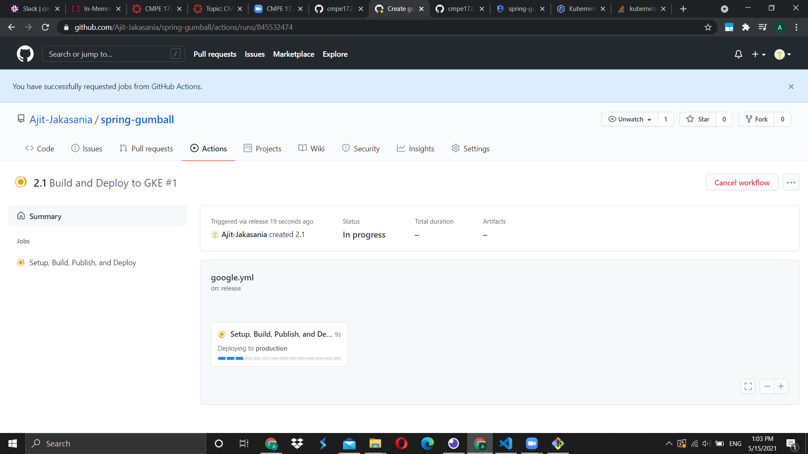
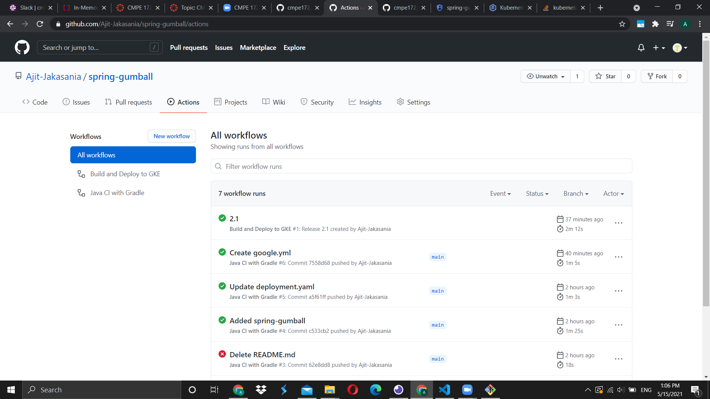
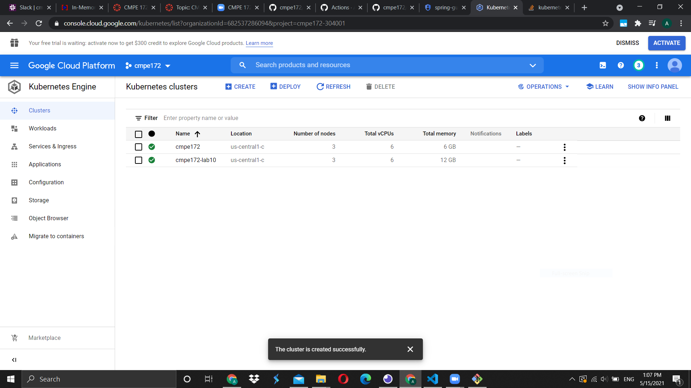
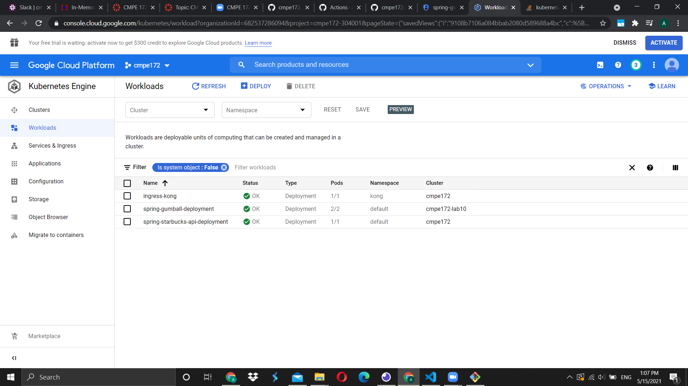
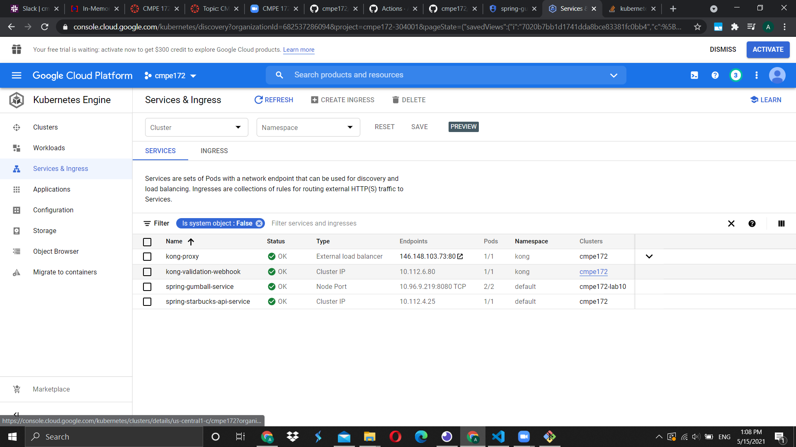
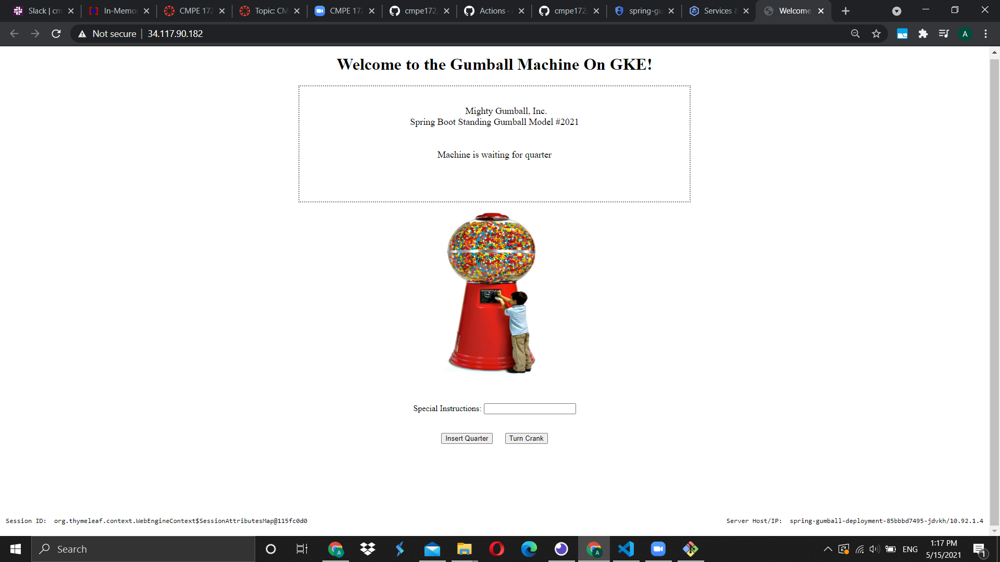

# CMPE 172 - Lab #10 - DevOps CI/CD Notes

## CI Workflow (Spring Gumball) 

 Figure 1. Shows successful workflow of Java CI with Gradle

## CD Workflow (Spring Gumball) 

 Figure 2. Shows created GCP Service Accoucnt

 Figure 3. Shows generated JSON Service Account Key

 Figure 4. Shows GitHub repository secrets

 Figure 5. Shows new release which will trigger CD workflow.

 Figure 6. Shows CD workflow building.

 Figure 7. Shows successful CD workflow build.

 Figure 8. Shows all GitHub actions workflows.

 Figure 9. Shows GKE Cluster named "cmpe172-lab10"

 Figure 10. Shows GKE spring-gumball-deployment with 2 pod running.

 Figure 11. Shows GKE service called spring-gumball-service running on Node Port.

 Figure 12. Shows spring-gumball-lb running on IP 34.117.90.182 which can be access by anyone.

 Figure 13. Shows spring-gumball web page running on 34.117.90.182.

### Challenges Encountered
I had challenges with gke-credentials and have to give permission when creating the GKE Service Account as my CD builds were failing before giving permissions.
